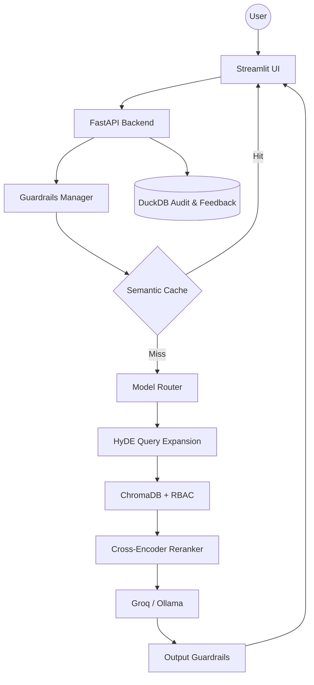

# 🚀 FinSolve RAG Pro - Enterprise-Grade AI Assistant

[](https://www.python.org/downloads/)
[](https://fastapi.tiangolo.com/)
[](https://streamlit.io/)
[](https://groq.com/)

**FinSolve RAG Pro** is a state-of-the-art Retrieval-Augmented Generation (RAG) assistant designed for enterprise environments. It goes beyond basic RAG by integrating advanced security, intelligent model routing, sophisticated retrieval techniques, and full production observability.

---

## 🌟 Key Enhancements (The "Pro" Advantage)

This version introduces several advanced features that elevate it from a prototype to a production-ready solution:

### 🔐 Advanced Security & Guardrails
- **Multi-Stage Pipeline**: Every query passes through a rigorous security check before reaching the LLM.
- **Prompt Injection Protection**: Heuristic-based detection of malicious prompt attempts.
- **PII Redaction**: Automatic identification and masking of sensitive data (Emails, Phone Numbers, SSNs).
- **Out-of-Scope Filtering**: Ensures the assistant stays focused on company-relevant topics (Finance, HR, Engineering).

### 🧠 Intelligent Model Routing
- **Complexity-Aware**: Real-time classification of queries into `SIMPLE`, `MODERATE`, or `COMPLEX`.
- **Dynamic Routing**: Automatically routes queries to the most cost-effective yet powerful model (e.g., `Llama-3.1-8b` for simple facts vs. `Llama-3.3-70b` for deep analysis).
- **Provider Support**: Seamlessly switch between **Groq** (Cloud) and **Ollama** (Local).

### 🔍 Enhanced Retrieval & RBAC
- **HyDE (Hypothetical Document Embeddings)**: Generates a hypothetical answer to expand the search query, significantly improving retrieval recall.
- **Cross-Encoder Reranking**: Re-orders retrieved documents based on their semantic relevance to the actual query, ensuring the top results are the most accurate.
- **Role-Based Access Control (RBAC)**: Enforces departmental boundaries, ensuring users only retrieve data they are authorized to see.

### 📊 Production Observability
- **Audit Logs**: Every interaction is logged into a **DuckDB** persistent store for audit trails.
- **Performance Metrics**: Real-time tracking of latency, token usage, and cost.
- **Monitoring Dashboard**: A dedicated Streamlit dashboard to visualize system health and user feedback.
- **HITL Feedback**: Integrated "thumbs-up/down" mechanism for human-in-the-loop quality improvement.

---

## 🏗️ Architecture



---

## 🚀 Quick Start

### 1. Prerequisites
- Python 3.10+
- [Groq API Key](https://console.groq.com/keys) (Optional, if using cloud models)
- [Ollama](https://ollama.ai/) (Optional, for local execution)

### 2. Installation
```bash
git clone https://github.com/sandhya-bdb/finsolve-rag-pro-with-guardrails.git
cd finsolve-rag-pro-with-guardrails
pip install -r requirements_prod.txt
```

### 3. Configuration
Copy the example environment file and add your keys:
```bash
cp .env.example .env
# Edit .env and add your GROQ_API_KEY
```

### 4. Data Ingestion
Populate your vector store with company data:
```bash
python3 app/embed_doc.py
```

### 5. Running the Application
Start the full stack:
```bash
# Terminal 1: Backend
python3 app/main.py

# Terminal 2: Chat UI
streamlit run app/UI.py

# Terminal 3: Monitoring Dashboard
streamlit run app/monitoring/dashboard.py
```

---

## 🔑 Demo Credentials

| Role | Username | Password | Access Level |
|---|---|---|---|
| **Executive** | `sandhya` | `ceopass` | Full Access (All Depts) |
| **Finance** | `Binoy` | `financepass` | Finance + General |
| **Engineering** | `Deb` | `password123` | Engineering + General |
| **HR** | `sangit` | `hrpass123` | HR + General |

---

## 📜 License
This project is licensed under the MIT License - see the [LICENSE](LICENSE) file for details.

Developed with ❤️ by the FinSolve AI Team.
