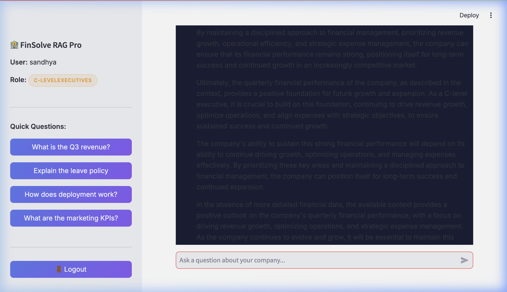
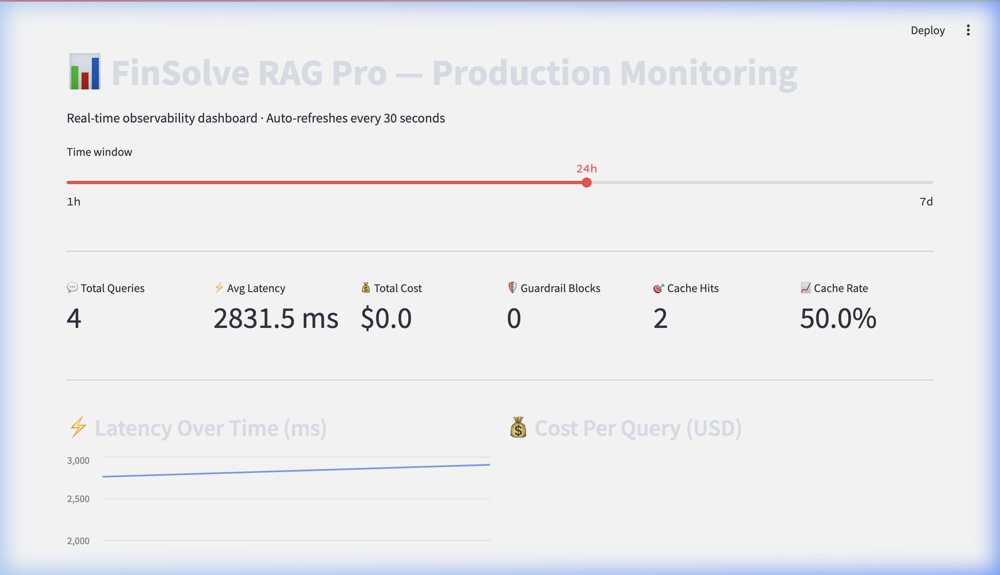
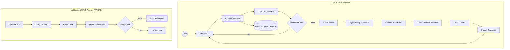

# 🏦 FinSolve RAG Pro: Enterprise-Grade AI Assistant

<p align="center">
  
  
  
  
  
</p>

**FinSolve RAG Pro** is a high-performance, secure, and observable Retrieval-Augmented Generation (RAG) system. Designed for the modern enterprise, it combines multi-stage security guardrails with intelligent model routing and advanced retrieval techniques to deliver accurate, context-aware financial insights.

---

## 📸 Interface Preview

| **✨ Premium Chat Interface** | **📊 Production Monitoring Dashboard** |
| :---: | :---: |
|  |  |

---

## 🛠️ The "Pro" Feature Suite

| Feature Category | Description | Business Impact |
| :--- | :--- | :--- |
| **🛡️ Multi-Stage Guardrails** | Heuristic & regex-based detection for **Prompt Injections**, **PII Disclosure**, and **Out-of-Scope** queries. | Prevents data leaks and ensures system misuse protection. |
| **🧠 Intelligent Routing** | Dynamically swaps between **Llama-3.1-8b** (Fast) and **Llama-3.3-70b** (Analytical) based on query complexity. | Optimizes for cost without sacrificing reasoning depth. |
| **🔍 Advanced Retrieval** | Implements **HyDE** (Hypothetical Document Embeddings) and **Cross-Encoder Reranking**. | Drastically improves retrieval recall and response precision. |
| **🔐 Granular RBAC** | Metadata-level filtering ensures users (Finance, HR, Eng) only see authorized department data. | Enforces strict enterprise data governance standards. |
| **🎯 Semantic Caching** | Vector-based caching for identical or semantically similar queries. | Sub-millisecond response times and 0 API cost for repeat questions. |
| **📈 Operational Metrics** | Real-time tracking of **Latency**, **Token Usage**, **Cost**, and **HITL Feedback**. | Total visibility into system health and ROI. |

---

## 🏗️ Technical Architecture

The system follow a modular, defensive architecture designed for local-first or cloud-hybrid deployments.



---

## ✅ Automated Evaluation (RAGAS)

The project includes a built-in evaluation framework to ensure high-quality, faithful responses. We use **RAGAS** metrics to validate the RAG pipeline during CI/CD:

| Metric | Purpose |
| :--- | :--- |
| **Faithfulness** | Ensures the answer is derived strictly from the retrieved context (no hallucinations). |
| **Answer Relevancy** | Measures how well the answer addresses the user's specific question. |
| **Context Precision** | Checks if the retrieved documents are truly relevant to the query. |
| **Context Recall** | Ensures the retrieved documents contain the actual information needed to answer. |

You can run a local evaluation suite with:
```bash
python3 eval/run_evaluation.py --threshold 0.3
```

---

## 👥 User Access Matrix

Testing the RBAC functionality is easy using these pre-configured demo accounts:

| User | Role/Department | Access Description | Default Password |
| :--- | :--- | :--- | :--- |
| **sandhya** | `c-levelexecutives` | **Superuser**: Access to all department documents. | `ceopass` |
| **Binoy** | `finance` | Access to Payroll, Q3/Q4 Reports, and general docs. | `financepass` |
| **sangit** | `hr` | Access to Leave Policies, Employee Manuals, etc. | `hrpass123` |
| **Deb** | `engineering` | Access to Tech Specs, Deployment Docs, and logs. | `password123` |
| **Karabi** | `employee` | Access to general/public company documents only. | `employeepass` |

---

## 🚀 Getting Started

### 1. Installation & Environment
```bash
git clone https://github.com/sandhya-bdb/finsolve-rag-pro-with-guardrails.git
cd finsolve-rag-pro-with-guardrails
pip install -r requirements_prod.txt
cp .env.example .env  # Add your GROQ_API_KEY here
```

### 2. Startup Commands
Run the stack in separate terminal windows:
```bash
# Start Backend
python3 app/main.py

# Start Chat UI
streamlit run app/UI.py

# Start Monitoring Dashboard
streamlit run app/monitoring/dashboard.py
```

---

## 🧱 Production Tech Stack

| Layer | Tools |
| :--- | :--- |
| **Backend** | **FastAPI**, **Uvicorn**, **Pydantic** |
| **RAG Pipeline** | **LangChain**, **Chromadb**, **Sentence-Transformers** |
| **LLM Provider** | **Groq** (Llama 3.3 / 3.1) or **Ollama** (Local) |
| **Persistence** | **DuckDB** (Audit logs, Metrics, Feedback) |
| **Frontend** | **Streamlit** (User Chat & Admin Analytics) |

---

## 📜 License
MIT License. Created with ❤️ for enterprise AI safety and performance.
